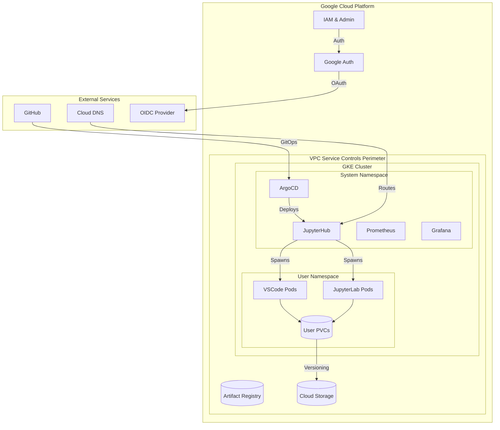
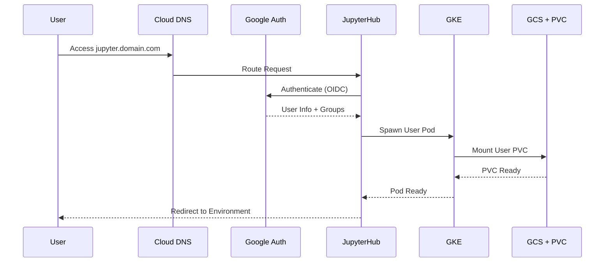
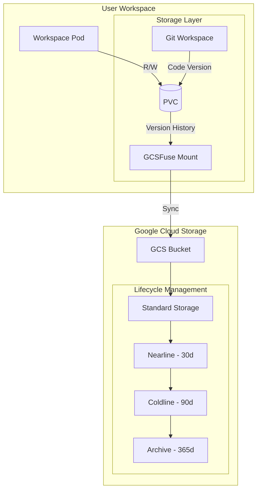
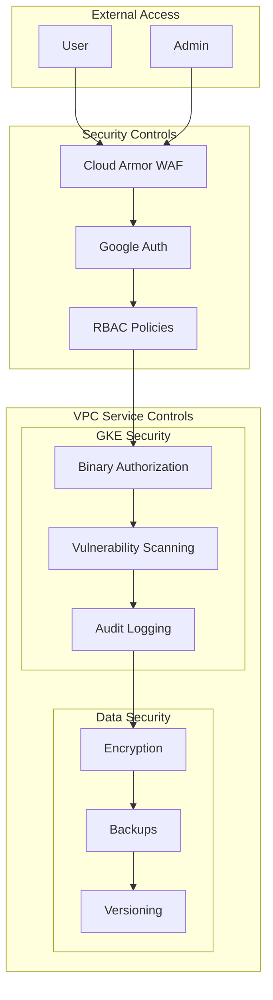
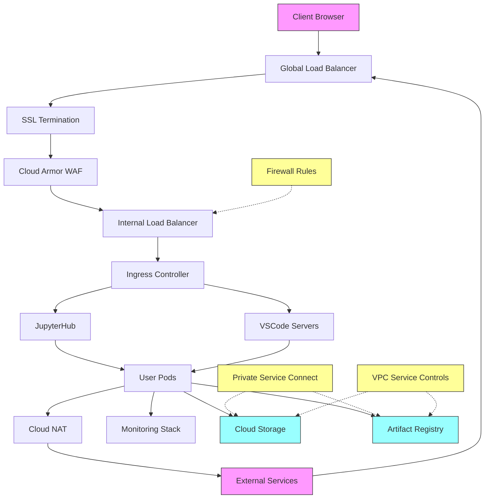
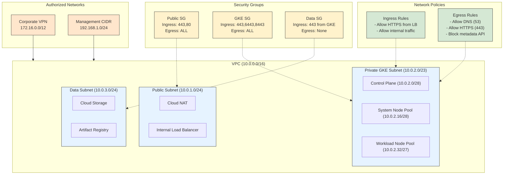
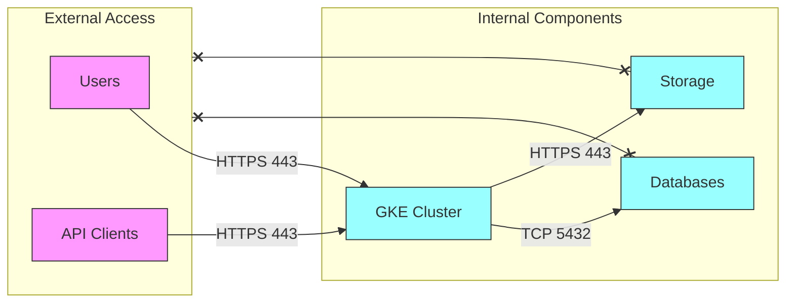
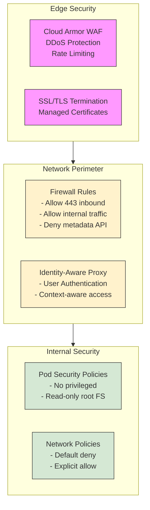
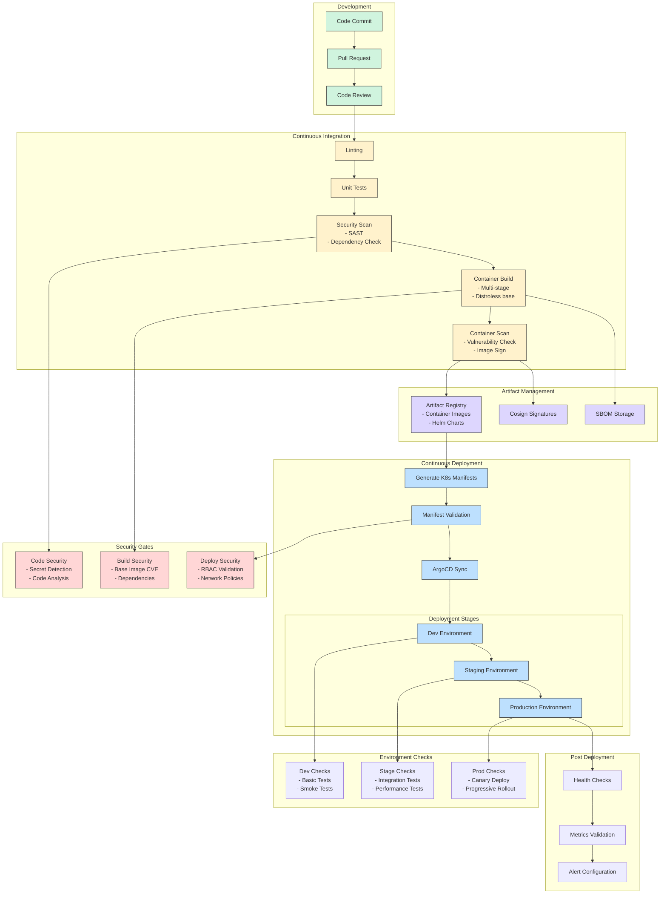
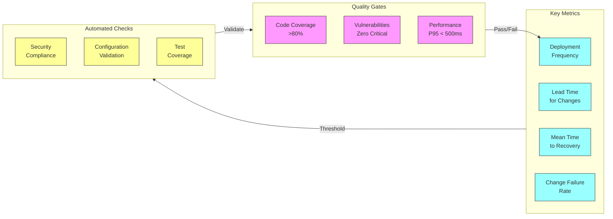

# Developer Platform Architecture Diagrams

## Infrastructure Overview

## Data Flow Architecture

## Storage Architecture

## Security Architecture

## Network Architecture

## Network Configuration Details

## Network Access Matrix

## Network Security Controls

## CI/CD Pipeline Architecture

## CI/CD Metrics and Gates

