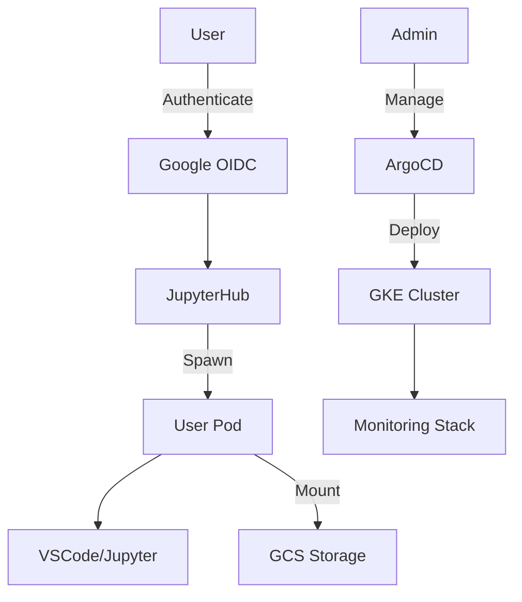

# Developer Platform Guide

## Table of Contents
- [Overview](#overview)
- [Quick Start](#quick-start)
- [User Guide](#user-guide)
- [Developer Guide](#developer-guide)
- [DevOps Guide](#devops-guide)
- [Security](#security)
- [Troubleshooting](#troubleshooting)
- [Contributing](#contributing)

## Overview

The Developer Platform is a production-grade environment running on Google Kubernetes Engine (GKE) that provides:
- On-demand VSCode and Jupyter environments
- Multi-layer versioning system
- Integrated authentication with Google Workspace
- Resource isolation and management
- Comprehensive monitoring

### Architecture Overview



### Key Components
- **Frontend**: JupyterHub + VSCode
- **Backend**: GKE + ArgoCD
- **Storage**: GCS with versioning
- **Auth**: Google OIDC
- **Monitoring**: Prometheus + Grafana

## Quick Start

### Prerequisites
- Google Cloud account with billing enabled
- Domain name for the platform
- Google Workspace (for authentication)
- `gcloud` CLI installed
- `kubectl` installed
- `terraform` installed

### Installation

1. Clone the repository:
   ```bash
   git clone https://github.com/youorg/developer-platform.git
   cd developer-platform
   ```

2. Configure environment:
   ```bash
   # Set up environment variables
   export PROJECT_ID="your-project-id"
   export DOMAIN="your-domain.com"
   export REGION="us-central1"
   ```

3. Run bootstrap:
   ```bash
   ./scripts/bootstrap.sh \
     --project-id=$PROJECT_ID \
     --domain=$DOMAIN \
     --region=$REGION
   ```

4. Verify installation:
   ```bash
   kubectl get pods -n developer-platform
   ```

## User Guide

### Getting Started

1. **Access the Platform**
   - Navigate to `https://jupyter.your-domain.com`
   - Sign in with your Google Workspace account
   - Select your environment type (Standard/High-Memory/GPU)

2. **Working with VSCode**
   - Access VSCode at `https://jupyter.your-domain.com/user/<username>/vscode`
   - Available extensions:
     - Python
     - Jupyter
     - Git
     - Docker

3. **Working with Jupyter**
   - Access Jupyter at `https://jupyter.your-domain.com/user/<username>/lab`
   - Available kernels:
     - Python 3
     - R
     - Julia

4. **Storage Management**
   - Files are automatically versioned
   - Access versions in `.versions/` directory
   - Use Git for code versioning

### Resource Profiles

1. **Standard Environment**
   - 2 CPU cores
   - 8GB RAM
   - Suitable for general development

2. **High Memory Environment**
   - 4 CPU cores
   - 16GB RAM
   - For memory-intensive workloads

3. **ML/GPU Environment**
   - 8 CPU cores
   - 32GB RAM
   - 1 NVIDIA T4 GPU
   - Pre-installed ML frameworks

## Developer Guide

### Local Development Setup

1. **Prerequisites**
   ```bash
   # Install required tools
   brew install kubectl terraform helm
   
   # Install development dependencies
   pip install -r requirements-dev.txt
   ```

2. **Development Environment**
   ```bash
   # Start minikube
   minikube start --driver=docker
   
   # Enable required addons
   minikube addons enable ingress
   minikube addons enable metrics-server
   ```

3. **Code Structure**
   ```
   .
   ├── infra/                 # Infrastructure code
   │   ├── modules/          # Terraform modules
   │   └── environments/     # Environment configs
   ├── k8s/                  # Kubernetes manifests
   │   ├── base/            # Base configurations
   │   └── overlays/        # Environment overlays
   └── runtime/             # Runtime configurations
   ```

### Making Changes

1. **Infrastructure Changes**
   ```bash
   # Navigate to environment directory
   cd infra/environments/prod
   
   # Initialize Terraform
   terraform init
   
   # Plan changes
   terraform plan
   
   # Apply changes
   terraform apply
   ```

2. **Kubernetes Changes**
   ```bash
   # Update manifests
   cd k8s/overlays/production
   
   # Test changes
   kustomize build . | kubectl apply --dry-run=client -f -
   
   # Apply changes
   kustomize build . | kubectl apply -f -
   ```

3. **Runtime Changes**
   ```bash
   # Build new image
   docker build -t gcr.io/$PROJECT_ID/vscode-jupyter:latest .
   
   # Test locally
   docker run -p 8080:8080 gcr.io/$PROJECT_ID/vscode-jupyter:latest
   
   # Push to registry
   docker push gcr.io/$PROJECT_ID/vscode-jupyter:latest
   ```

### Testing

1. **Unit Tests**
   ```bash
   # Run Python tests
   pytest tests/unit
   
   # Run infrastructure tests
   cd infra && go test ./...
   ```

2. **Integration Tests**
   ```bash
   # Run integration test suite
   ./scripts/integration-tests.sh
   ```

3. **End-to-End Tests**
   ```bash
   # Run E2E tests
   cypress run
   ```

### MLflow Integration

1. **Architecture**
   ```mermaid
   graph TD
       A[User Code] -->|Log Experiments| B[MLflow Server]
       B -->|Store Metrics| C[PostgreSQL]
       B -->|Store Artifacts| D[GCS]
       E[JupyterHub Auth] -->|Authenticate| B
       F[Backup Job] -->|Daily Backup| G[GCS Backups]
   ```

2. **Development Setup**
   ```bash
   # Test MLflow locally
   export MLFLOW_TRACKING_URI="http://localhost:5000"
   export MLFLOW_EXPERIMENT_NAME="dev-test"
   
   # Start local MLflow server
   mlflow server \
     --backend-store-uri postgresql://localhost/mlflow \
     --default-artifact-root gs://your-bucket/mlflow \
     --host 0.0.0.0
   ```

3. **Working with MLflow**
   ```python
   # Example experiment tracking
   import mlflow
   
   def train_model(params):
       mlflow.start_run():
           # Log parameters
           mlflow.log_params(params)
           
           # Your training code here
           model = train(params)
           
           # Log metrics
           mlflow.log_metrics({
               "accuracy": model.accuracy,
               "loss": model.loss
           })
           
           # Log model
           mlflow.sklearn.log_model(model, "model")
   ```

4. **Infrastructure Management**
   ```bash
   # Check MLflow server status
   kubectl get pods -n developer-platform -l app=mlflow
   
   # View MLflow logs
   kubectl logs -n developer-platform -l app=mlflow
   
   # Check database backups
   gsutil ls gs://your-bucket/mlflow/backups/
   ```

5. **Maintenance Tasks**
   - Database backup verification:
     ```bash
     # List recent backups
     gsutil ls -l gs://your-bucket/mlflow/backups/ | sort -k2 | tail -n 5
     
     # Verify backup integrity
     gsutil cp gs://your-bucket/mlflow/backups/latest.sql /tmp/
     pg_restore -l /tmp/latest.sql
     ```
   
   - Artifact cleanup:
     ```bash
     # List old artifacts
     gsutil ls -lr gs://your-bucket/mlflow/artifacts/
     
     # Clean up specific experiment
     mlflow gc --experiment-id <id>
     ```

6. **Troubleshooting**
   - Server issues:
     ```bash
     # Check server health
     kubectl describe pod -n developer-platform -l app=mlflow
     
     # Check database connection
     kubectl exec -it -n developer-platform mlflow-db-0 -- psql -U mlflow -d mlflow -c "\dt"
     ```
   
   - Client issues:
     ```python
     # Debug connection
     import mlflow
     print(f"Tracking URI: {mlflow.get_tracking_uri()}")
     print(f"Artifact URI: {mlflow.get_artifact_uri()}")
     ```

## DevOps Guide

### Deployment Pipeline

1. **CI/CD Setup**
   - GitHub Actions for automation
   - ArgoCD for GitOps
   - Container scanning with Trivy
   - Infrastructure testing with Terratest

2. **Release Process**
   ```bash
   # Create release
   git tag v1.0.0
   git push origin v1.0.0
   
   # Monitor deployment
   argocd app sync developer-platform
   ```

3. **Monitoring Setup**
   - Access Grafana: `https://grafana.your-domain.com`
   - Default dashboards:
     - Cluster Overview
     - User Resources
     - Storage Metrics

### Infrastructure Management

1. **Adding New Node Pool**
   ```hcl
   # In infra/modules/gke/main.tf
   resource "google_container_node_pool" "new_pool" {
     name       = "new-pool"
     location   = var.region
     cluster    = google_container_cluster.primary.name
     node_count = var.new_pool_count
     
     node_config {
       machine_type = "n1-standard-4"
     }
   }
   ```

2. **Scaling**
   ```bash
   # Scale node pool
   gcloud container clusters resize $CLUSTER_NAME \
     --node-pool=standard \
     --num-nodes=5
   
   # Update autoscaling
   kubectl patch hpa jupyter-autoscaler -p '{"spec":{"maxReplicas":10}}'
   ```

3. **Backup and Recovery**
   ```bash
   # Backup etcd
   gcloud container clusters backup-etcd $CLUSTER_NAME
   
   # Export user data
   ./scripts/export-user-data.sh
   ```

### Security Management

1. **Certificate Management**
   ```bash
   # Check cert-manager status
   kubectl get certificates -n developer-platform
   
   # Renew certificates
   kubectl delete secret tls-secret
   kubectl apply -f k8s/base/certificates.yaml
   ```

2. **Secret Management**
   ```bash
   # Update secrets
   kubectl create secret generic oauth-secret \
     --from-file=oauth.env \
     --dry-run=client -o yaml | \
     kubectl apply -f -
   ```

3. **Access Control**
   ```bash
   # Add new admin
   kubectl patch configmap auth-config \
     -p '{"data":{"ADMIN_GROUP":"new-admin@domain.com"}}'
   ```

## Security

### Authentication Flow

1. **OIDC Configuration**
   ```yaml
   # Update OIDC settings
   c.JupyterHub.authenticator_class = 'oauthenticator.GoogleOAuthenticator'
   c.GoogleOAuthenticator.oauth_callback_url = 'https://jupyter.${DOMAIN}/hub/oauth_callback'
   ```

2. **Role Management**
   ```yaml
   # Add new role
   apiVersion: rbac.authorization.k8s.io/v1
   kind: ClusterRole
   metadata:
     name: custom-role
   rules:
     - apiGroups: [""]
       resources: ["pods"]
       verbs: ["get", "list"]
   ```

### Security Best Practices

1. **Pod Security**
   ```yaml
   # Enable pod security policy
   apiVersion: policy/v1beta1
   kind: PodSecurityPolicy
   metadata:
     name: restricted
   spec:
     privileged: false
     # ... more restrictions
   ```

2. **Network Policy**
   ```yaml
   # Restrict pod communication
   apiVersion: networking.k8s.io/v1
   kind: NetworkPolicy
   metadata:
     name: restrict-traffic
   spec:
     podSelector: {}
     policyTypes:
     - Ingress
     - Egress
   ```

## Troubleshooting

### Common Issues

1. **Pod Startup Issues**
   ```bash
   # Check pod status
   kubectl describe pod <pod-name>
   
   # Check logs
   kubectl logs <pod-name>
   ```

2. **Storage Issues**
   ```bash
   # Check PVC status
   kubectl get pvc
   
   # Check GCS connectivity
   gsutil ls gs://${BUCKET_NAME}
   ```

3. **Authentication Issues**
   ```bash
   # Check OIDC logs
   kubectl logs -l app=jupyterhub -c hub
   
   # Verify secrets
   kubectl get secret oauth-secret -o yaml
   ```

### Debugging Tools

1. **Diagnostic Pod**
   ```bash
   # Run diagnostic pod
   kubectl run debugger --rm -i --tty \
     --image=ubuntu -- bash
   ```

2. **Network Debugging**
   ```bash
   # Test connectivity
   kubectl run nettest --rm -i --tty \
     --image=nicolaka/netshoot -- bash
   ```

3. **Resource Monitoring**
   ```bash
   # Check resource usage
   kubectl top pods
   kubectl top nodes
   ```

## Contributing

### Development Workflow

1. **Feature Development**
   ```bash
   # Create feature branch
   git checkout -b feature/new-feature
   
   # Develop and test
   make test
   
   # Submit PR
   gh pr create
   ```

2. **Code Review Process**
   - Submit PR with description
   - Pass automated checks
   - Get approval from maintainers
   - Merge to main branch

3. **Release Process**
   ```bash
   # Create release
   ./scripts/create-release.sh v1.0.0
   
   # Update documentation
   ./scripts/update-docs.sh
   ```

### Documentation

1. **Adding New Docs**
   ```bash
   # Create new doc
   touch docs/new-feature.md
   
   # Generate API docs
   ./scripts/generate-api-docs.sh
   ```

2. **Updating Guides**
   ```bash
   # Update developer guide
   vim docs/developer-guide.md
   
   # Build docs site
   mkdocs build
   ```

### Support and Community

- GitHub Issues for bug reports
- Discussions for feature requests
- Slack channel for community support
- Regular community meetings

---

## Additional Resources

- [Architecture Design Document](./architecture.md)
- [API Documentation](./api-docs.md)
- [Security Guidelines](./security.md)
- [Contribution Guidelines](./CONTRIBUTING.md)
- [Release Notes](./CHANGELOG.md)

mkdocs serve 
mkdocs build 