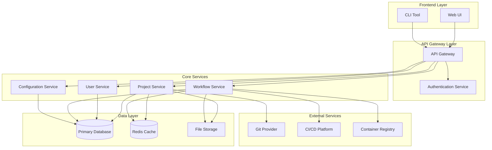
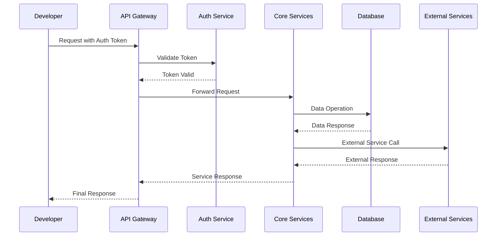
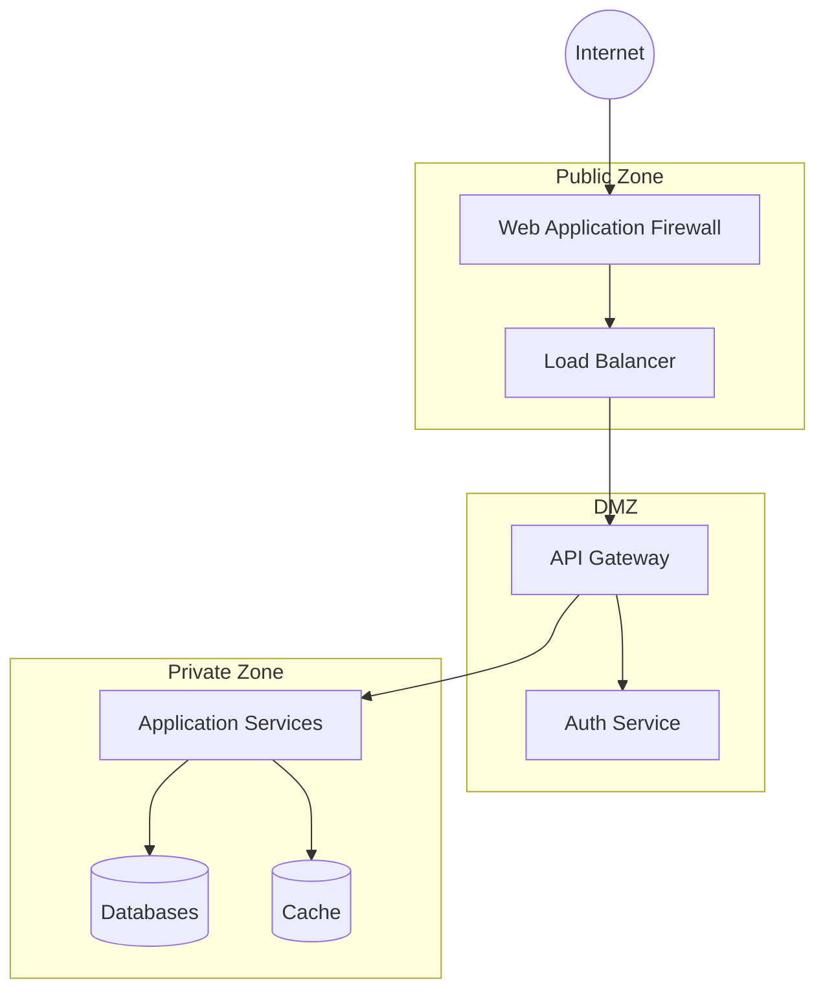

# High-Level Design Document

## Table of Contents
1. [System Overview](#system-overview)
2. [Architecture Components](#architecture-components)
3. [Data Flow](#data-flow)
4. [Network Architecture](#network-architecture)
5. [Configuration Management](#configuration-management)
6. [Security Considerations](#security-considerations)

## System Overview

This document outlines the high-level design of our Developer Platform, which serves as a comprehensive solution for managing and streamlining the development workflow.

### Architecture Diagram



## Architecture Components

### 1. Frontend Layer
- **Web UI**: React-based web application
- **CLI Tool**: Command-line interface for developers

### 2. API Gateway Layer
- **API Gateway**: Central entry point for all client requests
- **Authentication Service**: Handles user authentication and authorization

### 3. Core Services
- **Project Service**: Manages developer projects and repositories
- **User Service**: Handles user management and permissions
- **Workflow Service**: Orchestrates development workflows
- **Configuration Service**: Manages system and project configurations

### 4. Data Layer
- **Primary Database**: PostgreSQL for persistent storage
- **Redis Cache**: For high-performance caching
- **File Storage**: Object storage for artifacts and files

### 5. External Services
- **Git Provider**: Integration with Git repositories
- **CI/CD Platform**: Continuous Integration/Deployment
- **Container Registry**: Storage for container images

## Data Flow



## Network Architecture



## Configuration Management

### Environment Configuration
```yaml
# Example configuration structure
app:
  name: developer-platform
  version: 1.0.0

server:
  port: 8080
  host: 0.0.0.0

database:
  primary:
    host: ${DB_HOST}
    port: ${DB_PORT}
    name: ${DB_NAME}
  
cache:
  redis:
    host: ${REDIS_HOST}
    port: ${REDIS_PORT}

security:
  jwt:
    secret: ${JWT_SECRET}
    expiration: 24h

external:
  git:
    api_url: ${GIT_API_URL}
    token: ${GIT_TOKEN}
```

## Security Considerations

1. **Authentication & Authorization**
   - JWT-based authentication
   - Role-based access control (RBAC)
   - OAuth2.0 integration for external services

2. **Data Security**
   - Encryption at rest
   - TLS for data in transit
   - Regular security audits

3. **Network Security**
   - WAF protection
   - Rate limiting
   - DDoS protection

4. **Compliance**
   - GDPR compliance
   - Data retention policies
   - Audit logging 